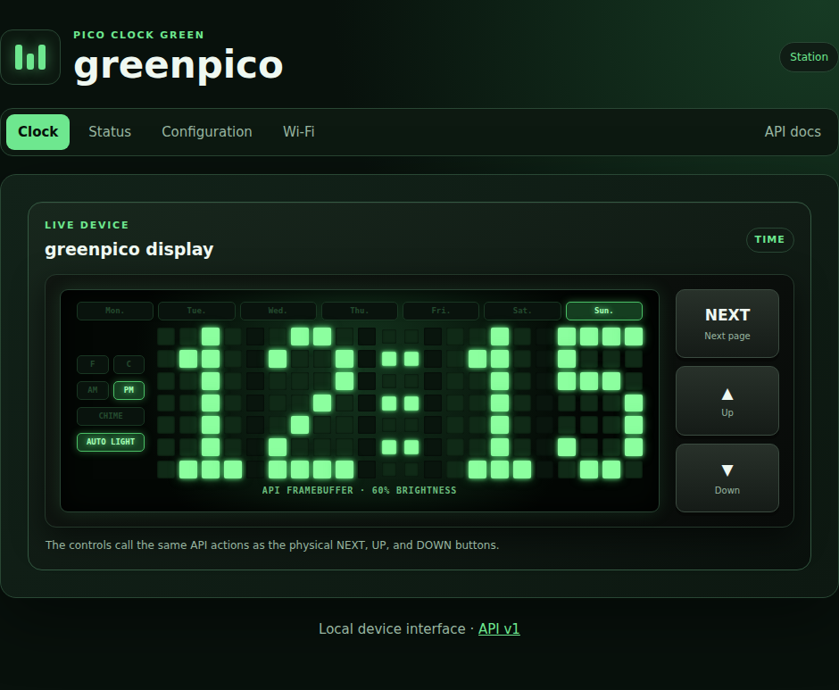
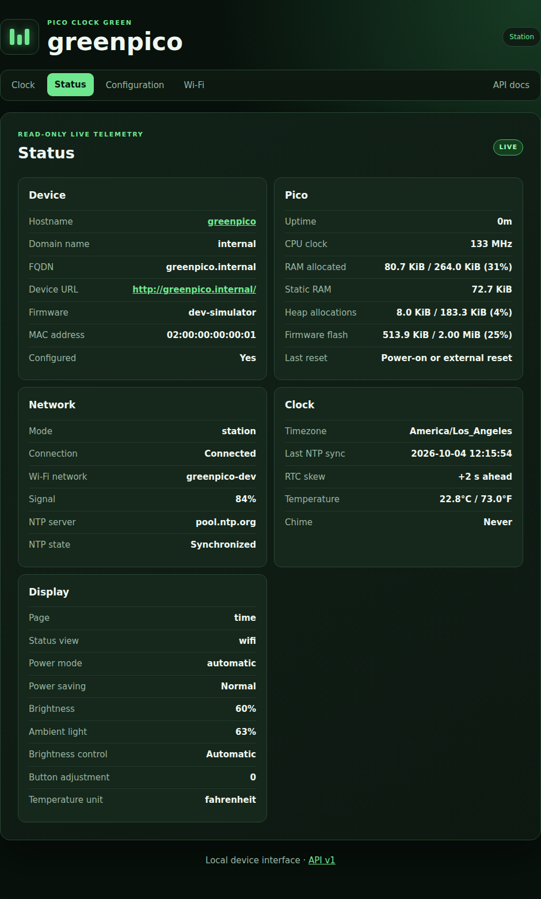
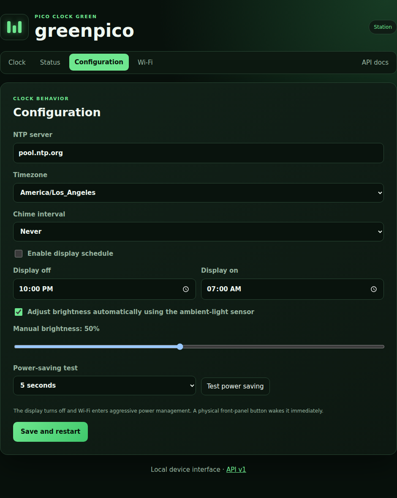
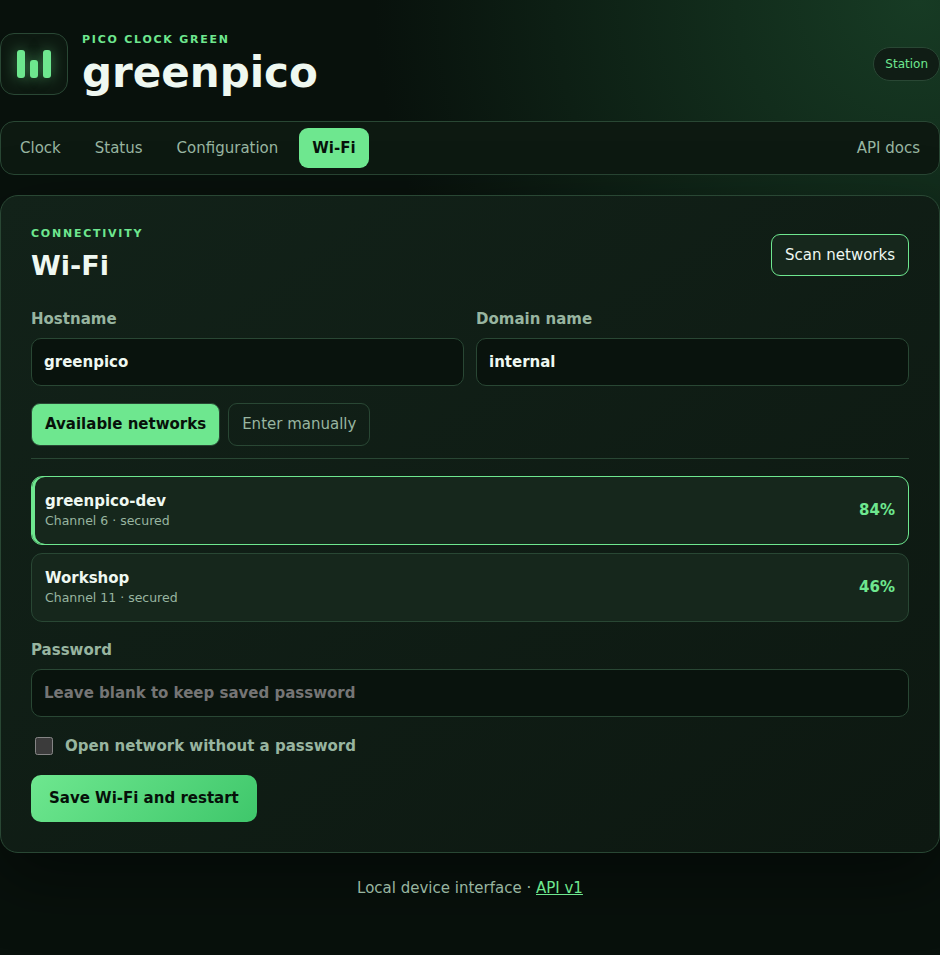

# greenpico

`greenpico` is modern firmware for the Waveshare Pico-Clock-Green. It turns the
Pico W clock into an NTP-synchronized, timezone-aware device with automatic
brightness, a display schedule, physical controls, a local HTTP API, and a
responsive browser interface.



## What it does

- Synchronizes from NTP at startup, every six hours, and on request, then keeps
  the DS3231 real-time clock updated.
- Applies the selected timezone and daylight-saving rules. There is no manual
  clock-setting mode: NTP is the time authority.
- Shows a four-digit 12-hour clock, AM/PM, weekday, and six-dot seconds progress
  on the 24x8 LED face.
- Provides Date, Temperature, and scrolling Status pages from the front panel
  or API.
- Adjusts display brightness from the ambient-light sensor, with a configurable
  manual mode and temporary button override.
- Supports hourly/half-hour/quarter-hour chimes and a daily display schedule.
- Keeps the API reachable while a scheduled-off display uses aggressive Wi-Fi
  power management; a button wakes the display immediately.
- Provides guided Wi-Fi setup, nearby-network scanning, and configurable local
  hostname/domain identity.

## Web interface

The device serves one self-contained, gzip-compressed page. Next.js and all
JavaScript are compiled before firmware is built; the Pico serves static bytes
and the browser performs the rendering. This keeps the embedded HTTP workload
small and avoids runtime Node.js dependencies.

### Live status

The Status view reports firmware, memory, reset reason, network and NTP state,
RTC skew, temperature, brightness, and current display mode.



### Clock configuration

Configure the NTP peer, timezone, chime, off/on schedule, and automatic or
manual brightness. The power-saving test can wake after 5, 10, or 15 seconds,
or wait indefinitely for a physical button.



### Wi-Fi configuration

Select a signal-sorted nearby network or enter a hidden SSID manually. The
hostname and local domain are configurable here too.



## First-time setup

On first boot, or when the saved network cannot be reached, connect to the open
`greenpico` Wi-Fi network and visit <http://192.168.4.1/>. Save the network and
clock settings. After a successful station connection, the setup network is
removed and the interface becomes available at the IP printed on USB serial.
With the defaults, routers that register DHCP names will usually make it
available at <http://greenpico.internal/>.

Changing the local domain does not register public DNS; name resolution depends
on the local router or DNS server. The recovery access point always remains
named `greenpico`.

## Front-panel controls

The page order is Time, Date, Temperature, then Status. Date and Temperature
return to Time after eight seconds. Status stays open so complete messages can
scroll; press SET to return to Time. Any button temporarily wakes a
scheduled-off display.

| Page | SET | UP | DOWN |
| --- | --- | --- | --- |
| Time | Next page | Brightness bias + | Brightness bias - |
| Date (`MON DD`) | Next page | Brightness bias + | Brightness bias - |
| Temperature | Next page | Select Fahrenheit | Select Celsius |
| Status | Return to Time | Next status item | Previous status item |

Status cycles through Wi-Fi, NTP, and Brightness. Its scrolling messages show
the active SSID and signal, NTP peer and synchronization state, and ambient and
actual display brightness.

Long presses provide the following shortcuts:

- Hold **SET** for two seconds to request NTP synchronization.
- Hold **UP** for two seconds for maximum brightness for 30 seconds.
- Hold **DOWN** for two seconds to sleep until the next schedule transition;
  on Status, it starts the setup access point instead.
- Hold **UP + DOWN** for five seconds to start setup mode for ten minutes.
- Hold **all three buttons** for ten seconds to erase settings and reboot.
  Releasing them during the displayed countdown cancels the reset.

## Local API

The API is the source of truth for both the web interface and front-panel
operations. Its [OpenAPI 3.1 contract](docs/api/openapi.yaml) documents every
request and response; [API usage notes and examples](docs/api/README.md) explain
the conventions. A running clock also serves interactive documentation at
`/docs` and a machine-readable discovery response at `/api/v1`.

Common read-only endpoints are:

```bash
curl http://greenpico.internal/api/v1/status
curl http://greenpico.internal/api/v1/time
curl http://greenpico.internal/api/v1/display
curl http://greenpico.internal/api/v1/config
```

The API has no authentication or TLS and is intended only for a trusted local
network. The setup access point is also open.

## Build

The supported development environment is Linux or WSL with GNU Make,
PlatformIO Core, Node.js/npm, and the Pico SDK packages resolved by PlatformIO.
WSL flashing additionally needs `usbipd-win` and PowerShell on the Windows host.

```bash
make web-install       # install pinned frontend packages
make web-test-install  # install Playwright Chromium once
make build             # production web export + release Pico W firmware
make firmware-info     # inspect the built ELF metadata
```

The release UF2 is written to `.pio/build/pico_w/firmware.uf2`. Dependencies
are pinned in `platformio.ini` and `web/package-lock.json`. See the
[development guide](docs/development.md) for prerequisites, WSL USB attachment,
upload, serial monitoring, and troubleshooting.

### GitHub releases

The Firmware GitHub Actions workflow runs native tests and builds the release
UF2 for pull requests, `main`, and manual runs. Each run retains
`greenpico-v<version>.uf2` and its SHA-256 checksum as a workflow artifact for
30 days. To publish them as permanent GitHub Release assets, update the version
sources together and push the matching tag:

```bash
git tag v1.0.0
git push origin v1.0.0
```

The workflow rejects a tag that does not match `kFirmwareVersion`, preventing a
release filename and compiled firmware version from diverging.

Use `make flash` for the complete device workflow. It runs native tests, builds,
attaches USB, uploads, waits for the rebooted application, refreshes `web/.env`
from its API, and runs the read-only Playwright suite against the clock.
Flashing changes the connected device; confirm that it is the intended Pico.

## Test suites

| Command | Coverage |
| --- | --- |
| `make test` | Native C++ unit tests for configuration, time, controls, display, networking helpers, power saving, and HTTP parsing |
| `make web-test` | Next.js UI against the deterministic local API simulator |
| `make web-test-embedded` | The exact compiled, inlined firmware page against the simulator |
| `make web-test-live` | Local UI against a physical clock's API; read-only |
| `make web-test-pico` | Page and API served by a physical clock; read-only |
| `make web-screenshots` | Rebuild and regenerate the README images from the embedded-page preview |
| `make build` | Production web compilation, asset validation, firmware compile/link, and UF2 generation |

The local browser suites cover hydration, all four navigation views,
configuration, both Wi-Fi entry modes, repeated polling, and API contracts.
Live-device suites deliberately avoid configuration writes, Wi-Fi scans,
virtual button presses, and restarts. Failure traces, videos, and screenshots
are retained under `web/test-results/`.

For interactive frontend work, run `make dev` and open
<http://localhost:3000/>. It uses a stateful simulator by default; the
localhost-only selector can switch to a physical clock. Set
`PICO_CLOCK_API_URL=http://greenpico.internal make dev` to select one at
startup.

## Documentation

- [Documentation index and hardware datasheets](docs/README.md)
- [Firmware architecture](docs/architecture.md)
- [Development and USB workflow](docs/development.md)
- [OpenAPI contract](docs/api/openapi.yaml)
- [API guide](docs/api/README.md)
- [Remaining roadmap](docs/roadmap.md)
